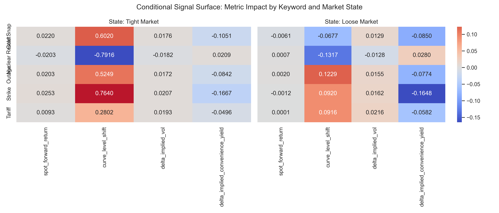
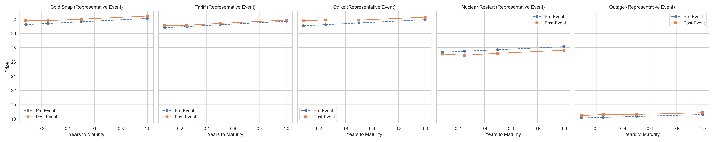
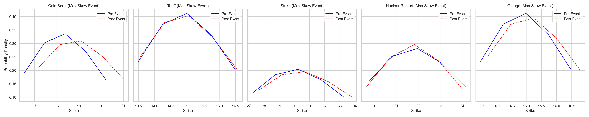
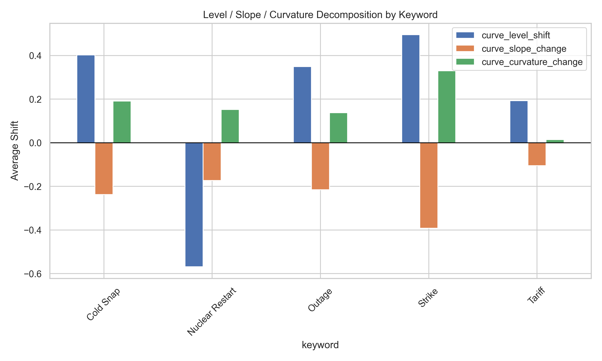
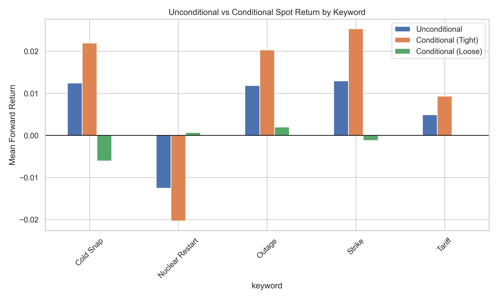

# Structural Event Study Framework for LNG Energy Markets

**Structural Event Study Framework for Energy Markets & News-Driven Strategies**

> **Ecosystem Integration**: This framework works in tandem with [-Global-LNG-Arbitrage-Monitor](https://github.com/EdisonLee9111/-Global-LNG-Arbitrage-Monitor). The Arbitrage Monitor identifies real-time cross-regional LNG price dislocations; this framework provides the structural event-study layer to explain **why** those dislocations occur — tracing news events through transmission channels to observable price effects on JKM, TTF, and the Henry Hub spread.

---

## The Problem with Naïve Event Studies

Traditional event studies treat news keywords as uniform signals: *"Nuclear Restart → LNG price falls."* This is a black box. It averages over all market conditions and produces an **unconditional mean return** that may be valid in no specific context.

This project opens the black box.

## Structural Theory

Every keyword maps to a **transmission channel** — a causal chain with identifiable intermediate steps and friction variables. For example:

```
Nuclear Restart news
  → Market updates expected restart timeline     [friction: credibility tier]
  → Expected nuclear capacity online increases   [friction: reactor MW]
  → Gas-fired generation dispatch displaced      [friction: is gas marginal?]
  → Regional LNG import demand decreases         [friction: contract rigidity]
  → Spot market bids decline                     [friction: inventory buffer]
  → JKM / TTF price adjusts
```

Each step has conditions that can **attenuate or block** the signal. The framework models these explicitly.

### The Core Equation

LNG spot price reflects the market's expectation of near-term supply-demand balance:

```
P = f(E[Demand] - E[Supply], Inventory, Friction)
```

The key insight: **f is non-linear**. The supply-demand curve's slope varies with market state. When the market is tight (low inventory, supply near capacity), a small disruption causes a large price move. When the market is loose, the same disruption barely registers.

This is not an assumption — it's a [falsifiable prediction](#falsifiable-predictions).

## What This Framework Does Differently

| Dimension | Original (v1) | Structural (v2) |
|-----------|---------------|-----------------|
| **Event response** | Scalar forward return | 7-dimensional vector (spot, curve shift, vol, skew, convenience yield) |
| **Market conditioning** | None (unconditional average) | State-conditional: tightness × transmission channel status |
| **Price data** | Spot only | Spot + futures term structure + options surface |
| **Skewness measure** | None | Risk reversal (model-free, for testing) + Breeden-Litzenberger density (for visualization) |
| **Statistical controls** | Single t-test per keyword | Hotelling T² joint test → Benjamini-Hochberg FDR on individual dimensions |
| **Negative control** | None | Placebo test on non-event timestamps |

## Derivatives-Implied Information

Instead of measuring only realized price changes, the framework extracts **forward-looking** information from derivatives:

| Source | What We Extract | Structural Meaning |
|--------|----------------|--------------------|
| **Futures curve shape change** | Level / slope / curvature shift | Impact magnitude, persistence, and term structure |
| **Implied volatility change** | ΔATM vol | Uncertainty resolution vs creation |
| **Risk reversal** (25Δ) | IV(call) − IV(put) | Tail risk asymmetry (model-free, robust) |
| **Breeden-Litzenberger density** | Full risk-neutral distribution | Distribution shape change (richer, for visualization) |
| **Implied convenience yield** | y = r + c − ln(F/S)/T | Market's valuation of inventory — directional tightness proxy |

> **Note on RR vs B-L skewness**: In this project's synthetic data (Black-76, controlled strike grid), both measures give consistent results. The distinction becomes critical in real LNG options markets where sparse strikes and wide bid-ask spreads make B-L numerically unstable. RR requires only two vol points; B-L requires the full strike grid.

> **Note on LNG implied convenience yield**: The quantity extracted by `y = r + c − ln(F/S)/T` is a **composite residual**, not the textbook convenience yield. It contains at least three unseparated components: (1) the true Kaldor convenience yield (value of holding physical inventory); (2) shipping optionality (the right to divert a cargo between JKM and TTF); (3) geographic basis risk (JKM DES Japan/Korea embeds the Asia-Pacific regional premium). The pseudo-spot problem compounds this: JKM "spot" is a 1–2 month forward assessment (Platts), so `ln(F/S)/T` is a forward-to-forward spread, not a true spot-futures spread.
>
> **State-dependent bias**: All three contaminating components amplify in the same direction in tight markets — shipping optionality becomes most valuable when supply is scarce, and the Asian premium widens as buyers compete for marginal cargoes. The residual therefore *overstates* the textbook convenience yield in tight markets and *understates* it in loose markets. The gap between this residual and the true concept is smallest when the market is near equilibrium, and the proxy is most trustworthy precisely when it is least needed.
>
> **Usage boundary**: The implied convenience yield is used in this framework as a **directional tightness classifier** (tight / neutral / loose via z-score threshold), not as a cardinal measure of storage value. Coefficient magnitudes on `delta_implied_convenience_yield` in the interaction regression should not be interpreted as structural elasticities across different tightness states: the noise-to-signal ratio of the residual is itself state-dependent, rising in the tight regime where the contaminating components are largest.

## Falsifiable Predictions

The structural model produces four testable predictions — three positive controls and one negative control:

### Prediction 0: Placebo Non-Significance (Negative Control)

> At random non-event timestamps, the 7-dimensional response vector should **not** be significantly different from zero.

This directly tests whether the framework manufactures false signals. More valuable than the three positive tests combined.

### Prediction 1: Tightness Interaction

> Same keyword's price impact is **larger** when the market is tight (low inventory, backwardation) vs loose.

Derived from the non-linearity of the supply-demand curve: steep slope in tight markets → larger price response to the same fundamental shock.

`market_tightness_score` is computed from storage deviation and spot-forward spread **only** — spark spread is excluded to avoid confounding with Prediction 3.

### Prediction 2: Capacity Proportionality (Nuclear Restart)

> Impact magnitude correlates with reactor capacity (MW).

A 1GW reactor restart should have roughly double the LNG price impact of a 0.5GW restart, controlling for market state.

### Prediction 3: Marginal Fuel Condition (Nuclear Restart)

> Impact ≈ 0 when gas-fired generation is **not** the marginal fuel (spark spread < 0).

If gas is out of the merit order, the Nuclear Restart transmission channel is **disconnected** — additional nuclear capacity displaces renewables or other baseload, not gas. The LNG demand link is severed.

`gas_is_marginal` is a separate boolean switch, independent of `market_tightness_score`.

## Architecture

```
┌──────────┐   ┌────────────┐   ┌───────────┐   ┌────────┐
│ theory   │──▶│ generators │──▶│ analytics │──▶│ main   │
└──────────┘   └────────────┘   └───────────┘   └────────┘
```

| File | Description |
|------|-------------|
| `config.py` | Global constants, asset configs, market parameters |
| `theory.py` | `TransmissionChannel` and `KeywordTheory` dataclasses — the structural model as code |
| `generators.py` | Synthetic data: news (with structural attributes), spot (GBM), futures curves, options surfaces, market state variables, placebo events |
| `analytics.py` | `CurveDecomposer`, `ImpliedDistribution` (B-L + RR), `ConvenienceYieldCalculator`, `StructuralEventAnalyzer` with interaction regression |
| `main.py` | End-to-end pipeline + all visualization |
| `tests/test_analytics.py` | Correctness: no-arbitrage, put-call parity, B-L recovery, convenience yield sensitivity (80% vs 95% utilization) |
| `tests/test_falsification.py` | Predictions 0–3 as formal statistical tests |

### Ecosystem Interface

This framework and the [Arbitrage Monitor](https://github.com/EdisonLee9111/-Global-LNG-Arbitrage-Monitor) are two layers of a unified LNG trading system. The data contract linking them is straightforward:

```text
Arbitrage Monitor                    Event Study Framework
┌─────────────────┐                 ┌────────────────────────────┐
│ netback spread  │──── input ───▶  │ market_tightness_score    │
│ shipping routes │                 │                            │
│ sentiment signal│──── input ───▶  │ news event trigger        │
└─────────────────┘                 └────────────────────────────┘
                                               │
                                      structural diagnosis:
                                     WHY the spread exists
```

- **Monitor Outputs**: Real-time netback spreads, shipping route frictions, and NLP sentiment signals.
- **Framework Consumes**: Spread magnitude maps to `market_tightness_score` (market state), and sentiment flags act as the `trigger` for the event study (the shock).
- **Mapping Logic**: The Monitor discovers *that* a price dislocation or arbitrage window has opened. This Framework takes those inputs and provides a structural diagnosis of *why* the spread exists by tracing the transmission channel.

## Statistical Testing Framework

To avoid false discovery inflation (5 keywords × 7 dimensions = 35 hypothesis tests), we use a two-layer approach:

**Layer 1 — Joint test**: Hotelling's T² on the full response vector per keyword. Only drill into individual dimensions if the joint null is rejected.

**Layer 2 — Adjusted individual tests**: Benjamini-Hochberg FDR control (α = 0.05) on dimension-level p-values for keywords that passed Layer 1.

Event count is set to **150** (30 per keyword) to ensure Hotelling T² has adequate power (n/p ≈ 4.3 with 7 response dimensions).

## Identification Assumptions

The framework's ability to separately estimate the liquidity effect, the tightness effect, and the keyword transmission effect rests on three joint assumptions. These are stated explicitly so they can be challenged.

### Assumption 1 — Effective Dimensionality

The 7-dimensional response vector contains correlated components (e.g., spot price change and futures curve level shift are mechanically linked because JKM "spot" is itself a 1–2 month forward assessment). The effective rank of the response matrix is lower than 7, which reduces the power of Hotelling's T² relative to its nominal dimension.

**What we do**: Report the VIF of regression controls and the approximate rank of the response covariance matrix alongside test results. Individual dimensions are only interpreted when Hotelling's T² rejects the joint null.

### Assumption 2 — Separability of Liquidity and Market Tightness

Liquidity (`liquidity_score`: active strikes, bid-ask spread, quote frequency) and market tightness (`market_tightness_score`: storage deviation + backwardation) are not independent in real LNG markets — tight conditions tend to coincide with thinner options markets as market-makers reduce risk appetite. High collinearity between these covariates in the interaction regression would make their individual coefficients unreliable.

**What we do**: In the synthetic data generator, liquidity variation is driven by a fast-moving variable (intraday trading session) while tightness evolves at a slow fundamental frequency (days/weeks). This produces partial decorrelation by construction. The synthetic experiment therefore estimates each effect in a world where the two covariates have *sufficient* independent variation — a controlled assumption that may not hold in real data.

**Scope boundary**: Coefficient estimates from the synthetic experiment represent best-case identification. In real LNG data, the collinearity between liquidity and tightness must be assessed empirically (VIF, pairwise correlation) before the two effects can be reported separately.

### Assumption 3 — Event-Timing Exogeneity

The trading session (which drives liquidity variation) must be independent of keyword type for the identification in Assumption 2 to be valid. In real LNG news flow, this exclusion restriction is likely violated:

- Strike news tends to emerge during European business hours (union negotiations, formal arbitration)
- Cold snap forecasts follow East Asian meteorological release cycles (JMA, KMA)
- Planned outage announcements follow company disclosure schedules

If `keyword_type → session_time` holds empirically, then keyword effects, session effects, and liquidity effects form a triangle of confounding that cannot be disentangled without a valid instrument. The synthetic data sidesteps this by assigning event timestamps uniformly across sessions — an assumption of exogenous event timing that real LNG news does not satisfy.

### A First-Order Finding About LNG Market Structure

The three assumptions above together imply a structural constraint that is itself of independent interest:

> **The precision of distributional information available to the analyst is negatively correlated with the magnitude of the price event.** Options markets become sparse (Assumptions 2–3 degrade) precisely during high-stress supply disruptions — when the full 7-dimensional analysis would be most valuable. In the lowest-liquidity regime, the framework degrades toward 2-dimensional analysis (spot + front-month futures) at the cost of losing distributional shape information.

This is not a solvable technical limitation. It is a structural feature of LNG market microstructure that any derivatives-based event study must acknowledge. The risk-reversal measure (`IV_25Δcall − IV_25Δput`) is used for hypothesis testing rather than full B-L density exactly because it is robust to this degradation: it requires only two vol points and remains estimable under partial liquidity.

---

## Quick Start

```bash
pip install -r requirements.txt
python main.py
```

## Output

- Console: structural summary table with raw and BH-adjusted p-values
- Console: Prediction 0–3 pass/fail results

### Conditional Signal Surface

*Heatmap showing how signal strength changes depending on market state.*

### Futures Curve Shift

*Pre vs post event curves overlaid per keyword, showing term structure deformation.*

### Implied Density Changes

*Changes in risk-neutral distributions extracted via Breeden-Litzenberger.*

### Curve Shift Decomposition

*Decomposition of curve shifts into level, slope, and curvature components.*

### Unconditional vs Conditional Comparison

*Demonstrating what averaging hides across market states.*

## Tech Stack

- Python 3.10+
- pandas, numpy (data & computation)
- scipy (t-tests, distributions)
- statsmodels (OLS interaction regression, Hotelling T², Benjamini-Hochberg)
- matplotlib + seaborn (visualization)
- tabulate (formatted console output)

## Keywords & Transmission Channels

| Keyword | Expected Direction | Transmission Logic | Marginal Fuel Required? |
|---------|-------------------|-------------------|------------------------|
| Strike | LONG (bullish) | Supply disruption → capacity offline → tighter balance | No |
| Outage | LONG (bullish) | Unplanned outage → same as Strike but less persistent | No |
| Cold Snap | LONG (bullish) | Demand surge → heating/power load ↑ → spot bid ↑ | No |
| Nuclear Restart | SHORT (bearish) | Baseload substitute online → gas dispatch ↓ → LNG demand ↓ | **Yes** |
| Tariff | LONG (mild) | Trade friction → flow reallocation → regional premium | No |

## References

- MacKinlay (1997)「Event Studies in Economics and Finance」『Journal of Economic Literature』: 13-39.
- Kolari & Pynnönen (2010)「Event Study Testing with Cross-sectional Correlation of Abnormal Returns」『Review of Financial Studies』: 3996-4025.
- Breeden & Litzenberger (1978)「Prices of State-Contingent Claims Implicit in Option Prices」『Journal of Business』: 621-651.
- Working (1949)「The Theory of Price of Storage」『American Economic Review』: 1254-1262.

## License

This project is licensed under the MIT License - see the [LICENSE](LICENSE) file for details.
